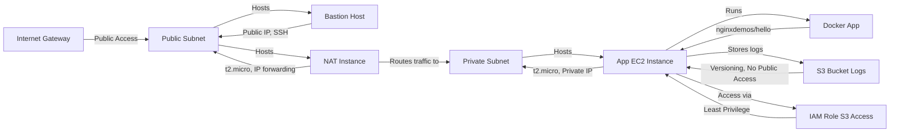

# AWS DevOps Project: Terraform & Docker Deployment

This project provisions AWS infrastructure using Terraform to deploy a Dockerized web application within AWS Free Tier limits. It includes a VPC with public and private subnets, a Bastion host for secure access, a NAT instance for private subnet internet access, an App EC2 instance running a Dockerized web app, an S3 bucket for logs, and IAM roles for secure access.

## Project Overview

The goal of this project is to demonstrate DevOps practices by automating the deployment of a simple web application using Terraform for infrastructure as code (IaC) and Docker for containerization. All resources are configured to stay within AWS Free Tier limits to minimize costs.

## Architecture Diagram



## Prerequisites

- **Terraform**: Installed on your local machine (version 1.0 or later).
- **AWS CLI**: Configured with credentials for an AWS account with sufficient permissions.
- **SSH Key**: An SSH key pair (`id_ed25519.pub` and `id_ed25519`) in `~/.ssh/` for secure access to instances.
- **Home IP**: Your public IP address to restrict Bastion host SSH access (update in `terraform.tfvars`).

## Deployment Instructions

1. **Clone or Navigate to Project Directory**:
   ```bash
   cd /path/to/aws-project-1
   ```

2. **Update Variables**:
   - Edit `terraform.tfvars` to set your `home_ip` to your current public IP address for SSH access.
   - Optionally, update `aws_region` if you prefer a different region (default is `us-west-2`).

3. **Initialize Terraform**:
   ```bash
   terraform init
   ```

4. **Review Planned Changes**:
   ```bash
   terraform plan
   ```

5. **Apply Infrastructure Changes**:
   ```bash
   terraform apply
   ```
   Confirm by typing `yes` when prompted.

6. **Access Outputs**:
   After deployment, Terraform will output critical information like the Bastion host's public IP, App EC2 private IP, S3 bucket name, and an SSH tunnel command. Save these for accessing your infrastructure.
   ```bash
   terraform output
   ```

## SSH Tunnel Instructions

To access the web application running on the App EC2 instance in the private subnet, you need to create an SSH tunnel through the Bastion host:

1. **Create SSH Tunnel**:
   Use the command provided in the Terraform output `ssh_tunnel_command`, or manually construct it as follows:
   ```bash
   ssh -i ~/.ssh/id_ed25519 -L 8080:<APP_PRIVATE_IP>:80 ec2-user@<BASTION_PUBLIC_IP>
   ```
   Replace `<APP_PRIVATE_IP>` and `<BASTION_PUBLIC_IP>` with the values from Terraform outputs.

   Alternatively, run it in the background:
   ```bash
   ssh -i ~/.ssh/id_ed25519 -fN -L 8080:<APP_PRIVATE_IP>:80 ec2-user@<BASTION_PUBLIC_IP>
   ```

2. **Access the Web App**:
   Open a web browser and navigate to `http://localhost:8080` to view the application (served by `nginxdemos/hello`).

3. **Close the Tunnel** (if not running in background):
   Simply terminate the SSH session with `Ctrl+C`, or if in background, find and kill the process:
   ```bash
   pkill -f "ssh -i ~/.ssh/id_ed25519 -fN -L 8080:<APP_PRIVATE_IP>:80"
   ```

## Design and Security Decisions

- **VPC Structure**: Separate public and private subnets for isolation. Public subnet hosts Bastion and NAT instances; private subnet hosts the App EC2 instance.
- **NAT Instance**: Used instead of NAT Gateway to stay within Free Tier limits, providing internet access to the private subnet for updates and Docker image pulls.
- **Bastion Host**: Acts as a secure entry point to the private subnet, with SSH access restricted to a specified home IP.
- **SSH Authentication**: Uses `id_ed25519.pub` for secure access to both Bastion and App instances.
- **Security Groups**: Configured with least privilege, allowing only necessary inbound traffic (SSH from home IP to Bastion, SSH from Bastion to App, HTTP within VPC to App).
- **IAM Roles**: Least privilege access for EC2 instances to interact with S3 for log storage (read/write operations only on the designated bucket).
- **S3 Security**: Bucket versioning is enabled for log history, and public access is blocked to prevent unauthorized access.

## Free Tier Usage Notes

This project is designed to stay within AWS Free Tier limits by:
- Using `t2.micro` instances for Bastion, NAT, and App servers (covered by Free Tier's 750 hours/month for 12 months).
- Avoiding services like NAT Gateway that incur additional costs.
- Using a simple, lightweight Docker image (`nginxdemos/hello`) to minimize resource usage.

**Important**: Monitor your AWS Billing Dashboard regularly to ensure you remain within Free Tier limits, especially if you extend usage beyond initial testing. S3 storage and data transfer may incur small charges if logs grow significantly.

## Cleanup Instructions

To avoid ongoing charges, destroy the infrastructure when it's no longer needed:

1. **Destroy Resources**:
   ```bash
   terraform destroy
   ```
   Confirm by typing `yes` when prompted. This will remove all AWS resources created by Terraform for this project.

2. **Verify Deletion**:
   Check the AWS Management Console to ensure all resources (VPC, EC2 instances, S3 bucket, IAM roles, etc.) are deleted.

## Troubleshooting

- **SSH Connection Issues**: Ensure your `home_ip` in `terraform.tfvars` matches your current public IP. Verify the SSH key path and permissions (`chmod 400 ~/.ssh/id_ed25519`).
- **Web App Not Accessible**: Confirm the SSH tunnel is active and correctly configured. Check if the Docker container is running on the App instance by SSHing through the Bastion.
- **Terraform Errors**: Review error messages for misconfigurations. Ensure AWS credentials are correctly set up via AWS CLI or environment variables.

## Additional Notes

- The project is modularized with Terraform modules for reusability (`vpc`, `ec2`, `iam`, `s3`).
- All resources are tagged with the project name `aws-devops-project` for easy identification in AWS Console.
- For further customization, you can replace the Docker image in the App EC2 user data script with a custom image or build.

If you encounter issues or need to extend this setup, refer to the Terraform and AWS documentation for advanced configurations.
